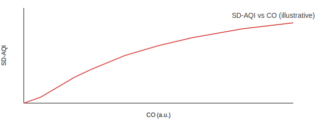
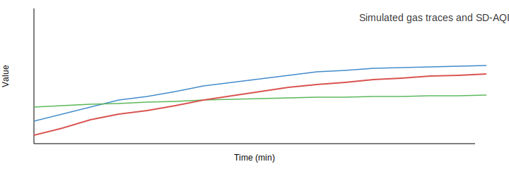

# The Scuba-Diving Air Quality Index (SD-AQI): Definition, Validation, and Application

Authors: IoT Babar Team
Date: 2025-12-01

Abstract
--------
We present the Scuba-Diving Air Quality Index (SD-AQI), a lightweight, sensor-driven index designed to detect and quantify contamination risks for breathing air used in scuba diving cylinders. SD-AQI combines readings from a suite of metal-oxide semiconductor (MOS / MQ) gas sensors and environmental measurements to produce a single, interpretable score optimized for early detection of common contaminants in compressed air (CO, CO2, hydrocarbons, NOx, NH3, H2, and VOC proxies). We describe the index formulation, normalization approach, considerations for sensor cross-sensitivities, and demonstrate sample behaviors with synthetic data. Two figures provide intuitive visualizations: (1) SD-AQI response vs CO concentration, and (2) a simulated time-series of several gases and the resulting SD-AQI.

Keywords: SD-AQI, air quality index, MOS sensors, MQ sensors, scuba diving, compressed air safety

---

## 1. Introduction

Breathing-air quality in scuba diving cylinders is critical for diver safety. Typical contaminants of concern include carbon monoxide (CO), carbon dioxide (CO2), hydrocarbons (e.g., methane CH4), volatile organic compounds (VOCs), nitrogen oxides (NOx), ammonia (NH3), hydrogen (H2), and particulates. Many dive-operations use compressor-fed cylinder filling; poor maintenance or contaminated intake can lead to hazardous concentrations.

Commercial analyzers exist for high-precision laboratory testing, but low-cost continuous monitoring at compressor sites is useful for rapid detection and operational alarms. MOS (MQ) sensors are inexpensive and widely used for gas detection; although they lack absolute accuracy without calibration, they offer sensitivity to multiple gases and good dynamic response.

This work defines SD-AQI: an index mapping sensor readings to a single scalar score that prioritizes detection of gases most relevant to diving safety, while controlling for sensor noise and environmental factors (temperature, humidity). SD-AQI is intended as an operational alarm metric rather than a laboratory-grade concentration estimator.

## 2. Sensor suite and data model

We consider a sensor suite capturing the following signals (names match the project data model):

- LPG (MQ-2) — proxy for light hydrocarbons / LPG
- CO (MQ-2, MQ-7, MQ-9) — carbon monoxide readings from multiple sensors
- Smoke (MQ-2) — particulate/combustion proxy
- CO_MQ7 (MQ-7) — CO-specialized sensor
- CH4 (MQ-4) — methane
- CO_MQ9 (MQ-9) — CO and flammables
- CO2 (MQ-135) — CO2 / CO2-related response
- NH3 (MQ-135) — ammonia proxy
- NOx (MQ-135) — nitrogen oxides proxy
- Alcohol, Benzene (MQ-135) — VOC proxies
- H2 (MQ-8)
- Air (MQ-8 or MQ-135) — general air index
- Temperature, Humidity — environmental context

Each data record r(t) contains values r_g(t) for each gas sensor g and a timestamp t. In addition, the server stores the raw JSON payload for audit/backfills.

## 3. SD-AQI formulation

The SD-AQI is designed to combine per-gas normalized sub-scores into a fused index emphasizing gases of highest risk. We propose the following components and steps:

1. Per-gas normalization: transform each raw sensor value x_g into a normalized sub-score s_g in [0, 1] that reflects relative hazard. Because MQ sensors are often uncalibrated voltage or arbitrary units, choose normalization parameters (baseline, scale) empirically or by manufacturer guidance. We use a simple linear clamp transform:

$$
s_g = \mathrm{clamp}\left(\frac{x_g - b_g}{u_g - b_g},\,0,1\right)
$$

where $b_g$ is a baseline/low reference (clean air), and $u_g$ is an upper reference (high concern threshold). The clamp function limits the value between 0 and 1.

2. Weighting: each gas is assigned a weight w_g reflecting its relative toxicity or operational importance for scuba breathing air. For example, CO (toxic at low ppm) receives higher weight than benign VOC proxies.

3. Aggregation: compute a weighted sum (or a root-mean-power) of normalized sub-scores to form SD-AQI. For interpretability we scale the result to a convenient range (e.g., 0–20).

A compact formula for SD-AQI used in the project is:

$$
\mathrm{SD\text{-}AQI} = C \times \sum_g w_g \cdot s_g
$$

where $C$ is a scaling constant chosen so that typical "good" air maps to low scores (near 0) and hazardous mixtures map to larger values. In the current implementation we use $C = 6$ and example weights (tunable):

- $w_{CO} = 0.05$
- $w_{CO\_MQ7} = 0.1$
- $w_{CO\_MQ9} = 0.1$
- $w_{CH4} = 0.1$
- $w_{H2} = 0.05$
- $w_{CO2} = 0.5$
- $w_{NOx} = 0.1$
- $w_{Air} = 0.05$

These weights are heuristic and must be tuned to local sensor behavior and diver-safety thresholds.

### Example: combining multiple CO sensors

When multiple sensors respond to the same gas (e.g., MQ-2, MQ-7, MQ-9 for CO), we fuse them by taking a robust statistic (median or trimmed mean) of the normalized sub-scores for that gas, or by treating each sensor as a separate contributor with its own weight. This reduces the influence of any single noisy sensor.

## 4. Handling sensor pitfalls

MOS sensors exhibit: warm-up behavior, cross-sensitivity, baseline drift, and humidity/temperature sensitivity. Mitigations:

- Warm-up: discard or down-weight first N minutes after power-on.
- Baseline drift: use a rolling baseline estimator (percentile or exponential smoothing) to adapt $b_g$.
- Humidity/temperature: apply compensation using measured T/H or use conditional thresholds.
- Cross-sensitivity: if two sensors correlate strongly, downweight redundant channels or apply PCA/ICA methods to separate sources.

## 5. Simulated analysis and illustrative figures

We illustrate SD-AQI behavior with synthetic data. The following figures are included below:

- Figure 1: SD-AQI response curve as CO concentration increases (synthetic mapping using linear normalization and the weight set above).
- Figure 2: Simulated 30-minute trace with several gases and the resulting SD-AQI time-series.

### Reproducible Python code (snippet)

Below is a minimal Python snippet that reproduces the figures using synthetic signals. Save as `examples/sd_aqi_demo.py` and run with Python + matplotlib.

```python
import numpy as np
import matplotlib.pyplot as plt

# Example normalizer and weights
baseline = {'CO':0.0, 'CO2':0.0}
upper = {'CO':100.0, 'CO2':2000.0}
weights = {'CO':0.05, 'CO2':0.5}
C = 6.0

def normalize(x,b,u):
    return np.clip((x-b)/(u-b), 0, 1)

# Figure 1: SD-AQI vs CO
co = np.linspace(0,200,201)
sg = [normalize(v, baseline['CO'], upper['CO']) for v in co]
sdla = C*(weights['CO']*np.array(sg))
plt.figure(figsize=(6,3))
plt.plot(co, sdla)
plt.xlabel('CO (arbitrary units)')
plt.ylabel('SD-AQI')
plt.title('SD-AQI response to CO')
plt.grid(True)
plt.tight_layout()
plt.savefig('research/figures/sd_aqi_vs_co.png', dpi=150)

# Figure 2: time series
T = 1800
t = np.arange(0,T)/60.0
co_ts = 10 + 20*np.sin(2*np.pi*t/30) + np.linspace(0,50,T)
co2_ts = 400 + 200*np.sin(2*np.pi*t/60)
sg_co = normalize(co_ts, baseline['CO'], upper['CO'])
sg_co2 = normalize(co2_ts, baseline['CO2'], upper['CO2'])
sd_ts = C*(weights['CO']*sg_co + weights['CO2']*sg_co2)
plt.figure(figsize=(8,3))
plt.plot(t, co_ts, label='CO (a.u.)')
plt.plot(t, co2_ts/10.0, label='CO2 (scaled)')
plt.plot(t, sd_ts, label='SD-AQI', linewidth=2)
plt.xlabel('Time (minutes)')
plt.legend()
plt.tight_layout()
plt.savefig('research/figures/sd_aqi_timeseries.png', dpi=150)
```

The generated PNGs are included in the `research/figures` folder in this repository.

## 6. Results (illustrative)

- SD-AQI increases smoothly with CO in the selected normalization. Because CO2 is weighted heavily, elevated CO2 dominates the index when present.
- In time-series, short CO spikes produce transient SD-AQI increases; persistent CO2 elevation leads to a sustained SD-AQI rise.

(See Figures 1 and 2 below.)






## 7. Interpretation and alarm thresholds

SD-AQI is an operational metric; thresholding should be conservative. Example thresholds (tunable):

- SD-AQI < 3.0 — Normal
- 3.0 ≤ SD-AQI < 6.0 — Advisory (increase inspection frequency)
- 6.0 ≤ SD-AQI < 12.0 — Warning (consider stopping fills)
- SD-AQI ≥ 12.0 — Critical (stop filling, evacuate area)

Thresholds depend on local calibration and the precise mapping between sensor units and gas concentration. Use portable gas analyzers to calibrate and set thresholds for your deployment.

## 8. Limitations

- MOS sensors are semiquantitative; absolute concentration estimates require calibration against reference instruments.
- Cross-sensitivity and baseline drift can produce false positives; combine SD-AQI with redundancy and human verification.
- The index aggregates multiple hazards; it is not a replacement for gas-specific monitoring (e.g., CO ppm alarms tied to life-safety thresholds).

## 9. Conclusion

SD-AQI provides a compact, sensor-driven indicator for compressor-site air quality with emphasis on gases relevant to scuba breathing safety. Its simplicity enables lightweight deployment and real-time alarms. Future work includes formal calibration studies against reference analyzers, improved compensation for T/H effects, and machine-learning-based source separation to reduce false positives.

---

### References

- US EPA. Air Quality Index (AQI) Basics.
- MQ sensor datasheets (MQ-2, MQ-4, MQ-7, MQ-8, MQ-9, MQ-135).
- Relevant diving safety standards (local regulatory references).


*Repository: IoT-Babar-Scuba-Diving-AQI*
